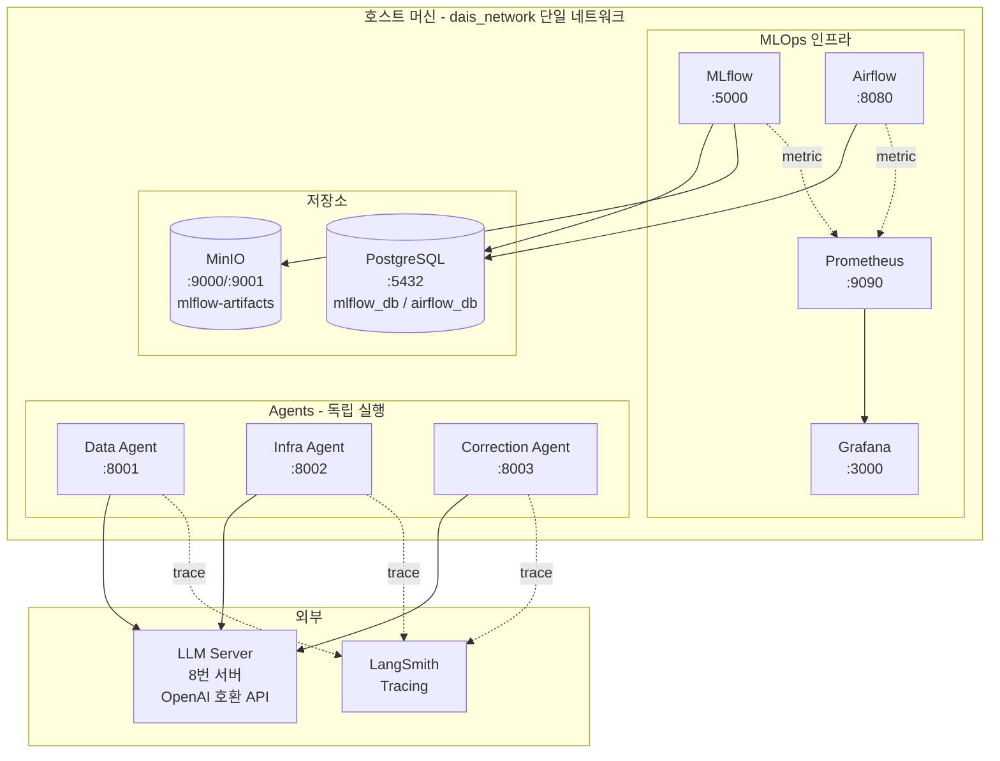

# 시스템 아키텍처

> 본 문서는 골격이다. Phase 진행에 따라 점진적으로 채워진다.

---

## 1. 전체 구성도



---

## 2. 핵심 결정사항

| 항목 | 결정 |
|---|---|
| Docker Network | 단일 network (`dais_network`) |
| MLflow Artifact | MinIO (S3 호환) |
| DB | 단일 Postgres 인스턴스, DB만 분리 (`mlflow_db`, `airflow_db`) |
| Agent 간 통신 | **없음** (각 Agent 독립 실행) |
| Agent Tracing | LangSmith |
| LLM | 외부 8번 서버 (OpenAI 호환 endpoint) |

상세 결정 배경은 [CLAUDE.md](../CLAUDE.md) "2. 확정된 결정사항" 참고.

---

## 3. 데이터 흐름 (Phase 3 이후 상세화)

### 학습 흐름
```
Airflow DAG (train_pipeline)
  → ml/train 스크립트 실행
  → MLflow Tracking 으로 metric/param/model 기록
  → MinIO 에 artifact 업로드
  → MLflow Model Registry 등록
  → (조건부) Production stage 승격
```

### 추론 흐름
```
Airflow DAG (inference_pipeline)
  → MLflow Registry 에서 Production 모델 로드
  → 추론 실행
  → 결과 저장 (TBD)
```

### Agent 동작 (Phase 4 이후 상세화)
- 각 Agent는 FastAPI 엔드포인트로 외부 트리거를 받는다.
- LangGraph 그래프 내부에서 Tool을 호출하여 작업 수행.
- LLM 호출은 모두 `agents/common/llm_client.py` factory를 통과.
- 모든 Agent 호출은 LangSmith에 trace 기록.

---

## 4. 관측성 (Observability)

| 계층 | 도구 | 비고 |
|---|---|---|
| 메트릭 | Prometheus → Grafana | 컨테이너/시스템 메트릭 |
| 로그 | Docker logs (Phase 2) | 추후 Loki 검토 가능 |
| Agent Trace | LangSmith | LLM 호출 추적 |
| MLflow Run | MLflow UI | 실험/모델 추적 |

---

## 5. TODO (Phase 진행에 따라 갱신)

- [ ] Phase 2 완료 시: 실제 컨테이너/볼륨 매핑 도식 추가
- [ ] Phase 3 완료 시: 학습/추론 흐름 시퀀스 다이어그램 추가
- [ ] Phase 4 완료 시: Agent 환경의 의존성 그래프 추가
